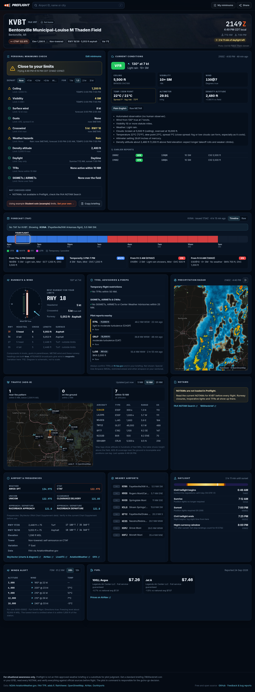

# Preflight

<p align="center">
  
</p>

**A free, at-a-glance airport briefing for student pilots, instructors and VFR pilots.**

Search any U.S. airport and Preflight pulls together what you would otherwise check across a dozen tabs: current weather decoded into plain English, an hour-by-hour TAF timeline, crosswind on the best runway, TFRs, SIGMETs/AIRMETs, nearby pilot reports, radar, live traffic, daylight and night-currency times, winds aloft, frequencies and fuel. Then it checks all of it against **your personal minimums** for the flight you are planning.

🔗 **Live site:** https://preflightapp.netlify.app/

This repository is the source for that one live app. Contributions made here ship to the live site, so improvements reach every pilot who uses it — the goal is to make **Preflight** better together, not to spin up separate copies. See [Contributing](#contributing) to get involved.

> ⚠️ **For situational awareness only.** Preflight is a convenience dashboard, **not** an official briefing source. Always verify with official FAA / NWS sources (1800wxbrief.com, aviationweather.gov, official NOTAM/TFR feeds) before every flight.

---

## Screenshot

The dashboard is a single page per airport (e.g. `/KVBT`). A full-page capture is included in the repo:

<details>
<summary>📸 <strong>Click to view the full-page screenshot</strong></summary>

<br>

[](screenshot.png)

</details>

> The image is large — [open `screenshot.png` directly](screenshot.png) for full resolution.

---

## Features

Search by identifier (`KVBT`, `VBT`, `7M5`), airport name, or city. Every airport has its own shareable URL, e.g. [`/KVBT`](https://preflightapp.netlify.app/KVBT).

| Card | What it shows |
| --- | --- |
| **Personal minimums check** | Your limits (or your solo endorsement's) checked against current *and* forecast conditions for a flight window you pick (now, +1 to +3 hr, or a set time; 1 to 3 hours long): ceiling, visibility, wind, gusts and gust spread, crosswind on the best runway that meets your surface/length limits, weather hazards, density altitude, daylight, TFRs, and SIGMETs/AIRMETs. Each check shows its value, your limit, and why. Anything that couldn't be checked (e.g. NOTAMs) is listed explicitly. |
| **Current conditions** | METAR with flight category, wind, visibility, ceiling, temp/dew point spread (fog risk), altimeter, density altitude, a plain-English decode, the last few reports, and what changed since you last looked. |
| **Forecast (TAF)** | A 24-hour flight-category timeline with TEMPO/PROB groups shown as overlays and your flight window marked, plus each forecast group in plain language. |
| **Runways & wind** | Runway diagram at true headings, head/tail and crosswind components (gusts included, variable wind treated as worst case) for every runway end, and the best runway for your limits. |
| **TFRs, advisories & PIREPs** | TFRs within 50 NM with active times and altitudes, SIGMETs / G-AIRMETs / Center Weather Advisories over or near the field, and pilot reports within 60 NM. |
| **NOTAMs** | Grouped by type (closures, runways, lighting, nav aids…) when FAA API credentials are configured; otherwise a clear "not loaded" notice with direct links. |
| **Radar & traffic** | Animated precipitation radar, and nearby ADS-B traffic with height above the field and pattern activity. |
| **Airport, daylight, winds aloft, fuel, nearby** | VHF frequencies (CTAF/tower first), runway data, sunrise/sunset/civil twilight and the night-currency window, nearest winds-aloft forecast with freezing level, AirNav fuel prices, and nearby airports' flight categories. |

Fields without their own weather reporting automatically use the nearest METAR (within 30 NM) and TAF (within 40 NM), clearly labeled. Times are shown in Zulu and in the airport's local time zone. **Copy briefing** puts a plain-text summary on your clipboard to text to a CFI or student.

Your minimums, home airport, and recent airports are stored only in your browser. There are no accounts and no tracking.

---

## Data Sources

All feeds except NOTAMs are free and need no API key. The browser never calls them directly: Netlify Functions proxy, normalize, and (where the source is slow or rate-limited) cache them in Netlify Blobs.

| Feed | Source |
| --- | --- |
| METAR, TAF, station info, PIREPs, SIGMETs, G-AIRMETs, CWAs, winds aloft | [AviationWeather.gov](https://aviationweather.gov/data/api/) (NOAA) |
| Airport & runway data (true runway alignment, magnetic variation) | FAA data via AviationWeather.gov; [OurAirports](https://ourairports.com/data/) (public domain) for search and for fields AviationWeather does not cover |
| Frequencies | FAA data via AviationWeather.gov, falling back to SkyVector/AirNav (cached 24 h) |
| TFRs | [FAA TFR GeoServer](https://tfr.faa.gov/) polygons and detail records |
| Precipitation radar | [RainViewer](https://www.rainviewer.com/) |
| Base maps | [OpenStreetMap](https://www.openstreetmap.org/) |
| ADS-B traffic | [adsb.fi](https://adsb.fi/) open data |
| Fuel prices | [AirNav](https://www.airnav.com/) (cached 6 h) |
| Airport photos | Wikipedia / Wikimedia Commons, with photographer and license credited |
| NOTAMs | [FAA NOTAM API](https://api.faa.gov/) *(requires free credentials, see below)* |

---

## Tech Stack

- **Frontend:** React 18, Vite 5, Tailwind CSS 3 (base) + hand-written CSS, [TanStack Query](https://tanstack.com/query), `lucide-react` icons, `date-fns-tz`.
- **Backend:** [Netlify Functions](https://docs.netlify.com/functions/overview/) (bundled with esbuild) behind a shared bearer-token guard, with a small read-through cache on [Netlify Blobs](https://docs.netlify.com/blobs/overview/).
- **Tests:** [Vitest](https://vitest.dev/) for the aviation math, parsers, and the minimums engine.
- **Hosting:** Netlify (static `dist` + functions), continuous deploy from `main`.

---

## Project Structure

```
preflight/
├── src/
│   ├── App.jsx                # Routing, data hooks, layout
│   ├── components/            # TopBar, Landing, AirportHeader, MinimumsEditor, ui primitives
│   │   └── cards/             # One component per dashboard card
│   ├── hooks/                 # Data hooks, URL routing, minimums, "since you last looked"
│   └── lib/
│       ├── aviation/          # wind, metar, taf, minimums, sun, density, notam (+ tests)
│       ├── format.js          # Zulu/local times, wind, visibility, units
│       └── briefing.js        # "Copy briefing" text
├── netlify/
│   ├── functions/             # airport, weather, advisories, tfr, notams, winds-aloft,
│   │                          #   traffic, radar, fuel, airport-image
│   └── lib/                   # shared http/auth, cache, geo, METAR/TAF normalization,
│       └── data/              #   winds-aloft parser; static airport + FD station data
├── scripts/build-airport-data.mjs   # regenerates the OurAirports-derived data
└── public/                    # icons, manifest, airport search index
```

---

## Local Development

Want to contribute? Here's how to get Preflight running on your machine to develop and test changes before opening a pull request.

**Prerequisites:** Node.js 20 or 22 (LTS) and npm. (The pinned Netlify CLI v17 fails to install on Node 26; use an LTS release.)

```bash
# 1. Install dependencies
npm install

# 2. Create your local env file
cp .env.example .env.local

# 3. Generate a shared auth token (any 32+ char random string works)
openssl rand -hex 32
```

Set **both** of these to that same value in `.env.local`:

- `VITE_API_AUTH_TOKEN` — sent by the browser
- `API_AUTH_TOKEN` — validated by the functions

Then start the dev server (Netlify Dev runs Vite + the functions together):

```bash
npm run dev
# open http://localhost:8888/KVBT
npm test        # run the test suite
```

> NOTAMs are the only feed that needs credentials. Without them, every other panel works and the NOTAM card simply shows a "not configured" notice.

### Environment Variables

| Variable | Required | Purpose |
| --- | --- | --- |
| `API_AUTH_TOKEN` | ✅ | Server-side token used by Netlify Functions to authorize requests. |
| `VITE_API_AUTH_TOKEN` | ✅ | Browser-side token sent to the functions. **Must exactly match** `API_AUTH_TOKEN` and be present *before* the Vite build runs. |
| `VITE_AIRPORT_ICAO` | optional | Pins a default airport for first-time visitors. When unset, first-time visitors see the landing page. (Returning visitors resume their last airport.) |
| `FAA_NOTAM_CLIENT_ID` | optional | FAA NOTAM API client ID — register free at [api.faa.gov](https://api.faa.gov/). |
| `FAA_NOTAM_CLIENT_SECRET` | optional | FAA NOTAM API client secret. |

> ℹ️ **Security note:** `VITE_*` variables are compiled into the browser bundle and are therefore readable by anyone who loads the page. The shared token only deters random scanners from hitting the function URLs directly — it is **not** a secret and is not meant to protect against a determined visitor. Keep your *local* token different from production, and never reuse a real secret in a `VITE_` variable.

---

## Contributing

Preflight is **one live application**, and this repository is its source of truth. The goal isn't for everyone to run their own copy — it's to improve the single app that pilots actually use. When a change lands on `main`, it deploys automatically to [preflightapp.netlify.app](https://preflightapp.netlify.app/).

Contributions of all sizes are welcome — bug fixes, new data sources, UI polish, or just blunt "this is bad practice, here's why" feedback.

**Workflow:**

1. **Fork** this repo and create a branch for your change.
2. Get it running locally (see [Local Development](#local-development)) and test against a few real airports.
3. Run `npm test` and `npm run lint` and make sure both pass.
4. Open a **pull request** against `main` describing what you changed and why.
5. Once reviewed and merged, your change ships to the live site automatically.

Not sure where to start? Open an [issue](../../issues) — bug reports, feature ideas, and questions are all fair game.

---

## Known Limitations

- The **personal minimums check** is a decision aid. It does not replace a standard briefing, a full read of the NOTAMs, or pilot judgment, and it does not know about your aircraft's performance.
- **NOTAMs** are only shown when FAA API credentials are configured. Without them, the app says so and links to the FAA NOTAM Search; it never treats missing NOTAMs as "no NOTAMs".
- **Density altitude** uses the standard rule-of-thumb formula, not a POH performance calculation.
- **Special use airspace** (MOAs, restricted areas) and airspace classes are not shown.
- **Fuel prices and fallback frequencies** come from third-party pages whose formats change; always confirm against the Chart Supplement and the FBO.
- **ADS-B traffic** depends on adsb.fi coverage, which is incomplete near the ground. Not every aircraft broadcasts ADS-B.
- **Winds aloft** cover the contiguous U.S. only.

---

## Scripts

| Command | Description |
| --- | --- |
| `npm run dev` | Netlify Dev (Vite + functions) on `http://localhost:8888`. |
| `npm run vite-only` | Vite dev server only (no functions). |
| `npm run build` | Production build to `dist/`. |
| `npm run preview` | Preview the production build. |
| `npm test` | Run the Vitest suite. |
| `npm run lint` | ESLint over `src`, `netlify`, and `scripts`. |
| `npm run build:airports` | Regenerate the OurAirports-derived search index and fallback airport data. |

---

## Disclaimer

Preflight is a personal project provided for educational and situational-awareness purposes only. It is **not** an approved source for flight planning, weather briefing, or operational decisions. The author assumes no responsibility for decisions made using this tool. **The pilot in command is always responsible for verifying all information against official sources.**

---

## A Note on How This Was Built

This project was built with significant help from AI (Claude). I worked as a web developer early in my career, but that was a long time ago, and I'll happily admit those skills have gotten rusty in the years since. Preflight is a domain project built by someone scratching their own itch — a tool to solve a real problem I had as a student pilot — not a polished commercial product.

What I've checked so far has mostly been hands-on:

- Manual testing in the browser against a range of real U.S. airports (towered and non-towered, single- and multi-runway, with and without live fuel/NOTAM data)
- That each panel degrades gracefully when its data source is unavailable or returns nothing
- ESLint passes cleanly

That leaves plenty I'd genuinely welcome a second set of eyes on:

- **Security & input validation** — especially the Netlify Functions and how external API data is handled
- **Edge cases** I haven't thought to test
- **Code quality & idiomatic patterns** — places where this isn't the modern, idiomatic way to do things

Issues and PRs are genuinely welcome — including blunt "this is bad practice, here's why" feedback. I'm here to learn.

---

## License

Released under the [MIT License](LICENSE).
